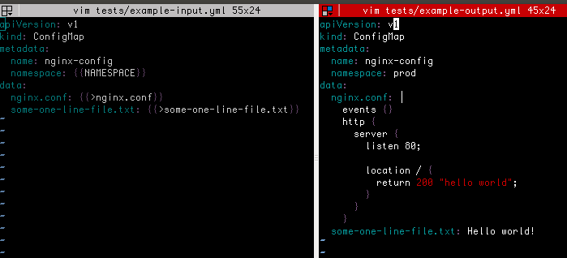

[](https://travis-ci.com/sdenel/fill-from-env)

Tested against Python 2.7, 3.5, 3.6

A small Python tool that parses YAML files to include environment variables and configuration files:
* **{{ENV_VARIABLES_PROVIDED_THIS_WAY}}**
* **{{>FILES_TO_INCLUDE_AS_STRING_PROVIDED_THAT_WAY}}**

The output is written in stdout.

# Examples
```bash
export NAMESPACE="prod"
fill-yaml-from-env tests/example-input.yml > tests/example-input-parsed.yml
``` 


# Installation

Clone the repository:
```bash
mkdir -P ~/bin
cd ~/bin
git clone https://github.com/sdenel/fill-yaml-from-env
```

Then for example in your ~/.bashrc or ~/.zshrc file:
```bash
export PATH="~/bin/fill-yaml-from-env:$PATH"
```

# Usage with Kubernetes
This tools allows to easily add env variables to Kubernetes YAML templates. Example:
```bash
export DATA_DIR=/postgres
fill-yaml-from-env postgres-deployment.yaml | kubectl create -f -
```
